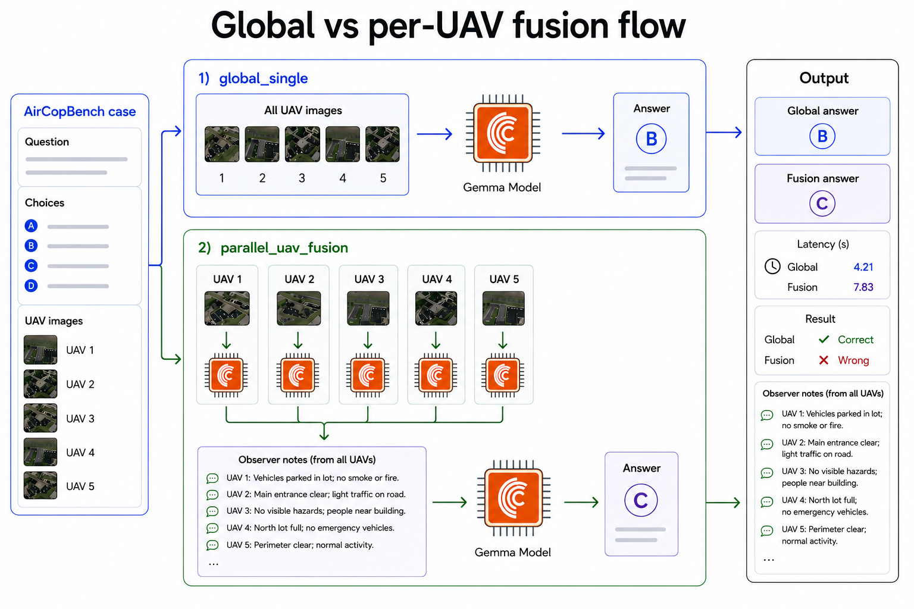

# Correct but late is stale.

[AirCopBench](https://arxiv.org/abs/2511.11025) shows multi-UAV perception is hard.  
With Cerebras-hosted Gemma inference, a next applied question is:

> Can faster multimodal inference create room for multi-call UAV workflows that improve hard benchmark answers before they become stale?

This project tests one research-motivated idea: parallel per-UAV perception followed by fusion of the results.

The point is:

> lower latency expands the design space for applied UAV workflows, but adding more inference calls only helps when the workflow improves the right cases enough to justify its latency cost.
## What this demo tests



The comparison is simple:

- `global_single`: one model call over all UAV images.
- `parallel_uav_fusion`: one model call per UAV image, then one final call to combine the notes.

Scored by:

```text
actionable = correct AND latency_ms <= deadline_ms
```

## Results

🔗 [Watch the Loom video](https://www.loom.com/share/ed357558a8ca4a21be1caf3e750e75d2) or 🎥 [Download 60s MP4 version](docs/assets/demo.mp4)


`global_single` was the stronger default workflow, while `parallel_uav_fusion` fixed some cases but also introduced comparable regressions and added latency.

This implies that Cerebras/Gemma inference can make multi-call UAV workflows practical to test inside a decision window, but those workflows need evidence. Use decomposition or another multi-agent architecture only when it is proven to work consistently.

**See the full benchmark story here:** [Benchmark Results](docs/05_benchmark_results.md)

**Replay selected benchmark cases locally:**

```bash
python3 -m pip install -r requirements-demo.txt
python3 -m streamlit run demo/replay_app.py
```

## FAQ

Note: For the original benchmark task definitions, see: [AirCopBench task definitions](https://github.com/zhajirong/AirCopBench#task-definition)

---
  <details>
   <summary>Why AirCopBench is a useful benchmark for this project.</summary>

   AirCopBench is useful because it already provides the hard part of the testbed:

   - multi-UAV images
   - text questions
   - A/B/C/D answer choices
   - ground-truth labels
   - task categories for perception, assessment, and collaboration

   That means this project does not need to invent a drone benchmark.

   AirCopBench is also a better fit than generic image VQA because the tasks are built around multi-drone collaboration.

   The original AirCopBench scoring asks: Was the answer correct?

   This project adds: Was the answer correct within a task-relevant latency threshold?

   So AirCopBench provides the benchmark substrate, and this project adds latency-scaled workflow evaluation.

   </details>

---

   <details>
   <summary>Why AirCopBench failure modes justify per-UAV perception plus fusion.</summary>

   AirCopBench shows that multi-UAV multimodal models fail in ways that need structured cross-view evidence.

   > "The errors in MLLM reasoning primarily stem from three causes: (1) Perception Hallucination Errors... (2) Spatial Reasoning Errors... (3) Multi-image Understanding Errors..." (AirCopBench, arXiv 2511.11025)

   AirCopBench input is naturally separated by UAV view. This means a single global call can under-attend to one image or have conflicting evidence across images.

   The tested workflow uses decomposition plus aggregation:
   1. inspect each UAV view independently
   2. preserve a short structured observation per view
   3. compare all observations against the same question and choices
   4. return one final answer

   This is not a claim that a second model can just reliably verify the first model. A regular second pass verifier can share the same blind spots but view-level decomposition can maybe improve what evidence reaches the final decision.

   To recap.

   AirCopBench failure: hallucination + spatial errors + multi-image errors

   Possible Per-UAV fusion response: view-specific observations + cross-view comparison + final answer

   The test is: can parallel per-UAV fusion improve accuracy and actionability over global_single enough to justify its added latency?

   </details>

---

   <details>
   <summary>Why better answers only matter if they arrive before the deadline.</summary>

   Correct answers are not always useful if they arrive after the decision window has passed.

   This project scores actionability as:

   ```text
   actionable = correct AND latency_ms <= deadline_ms
   ```

   The long-term target is the **100-500 ms** range, not because that number was chosen by vibes, but because robotics and teleoperation research shows that delay can affect whether visual information is still useful for action.

   Examples:

   * One mobile-robot teleoperation study reports human delay perception around **100-200 ms**, performance degradation around **200-300 ms**, and delay-cost saturation around **400 ms**.
   Source: Chen et al., 2025 — https://arxiv.org/abs/2508.18074

   * One vision-teleoperation study reports sharp closed-loop degradation between **150 ms and 225 ms** of one-way perception latency.
   Source: Khalil and Kwon, 2026 — https://arxiv.org/abs/2603.06850

   This project does not claim to hit those real-time control deadlines yet. Current cloud multimodal workflows are still slower.


   </details>

---

## Citation

This project uses AirCopBench as the multi-UAV benchmark source.

```bibtex
@inproceedings{zha2026aircopbench,
  title={Aircopbench: A benchmark for multi-drone collaborative embodied perception and reasoning},
  author={Zha, Jirong and Fan, Yuxuan and Zhang, Tianyu and Chen, Geng and Chen, Yingfeng and Gao, Chen and Chen, Xinlei},
  booktitle={Proceedings of the AAAI Conference on Artificial Intelligence},
  volume={40},
  number={2},
  pages={1507--1515},
  year={2026}
}
```
