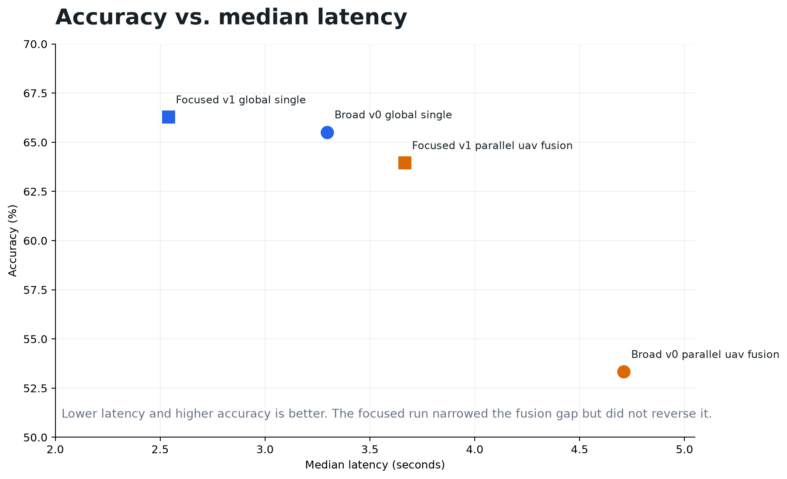
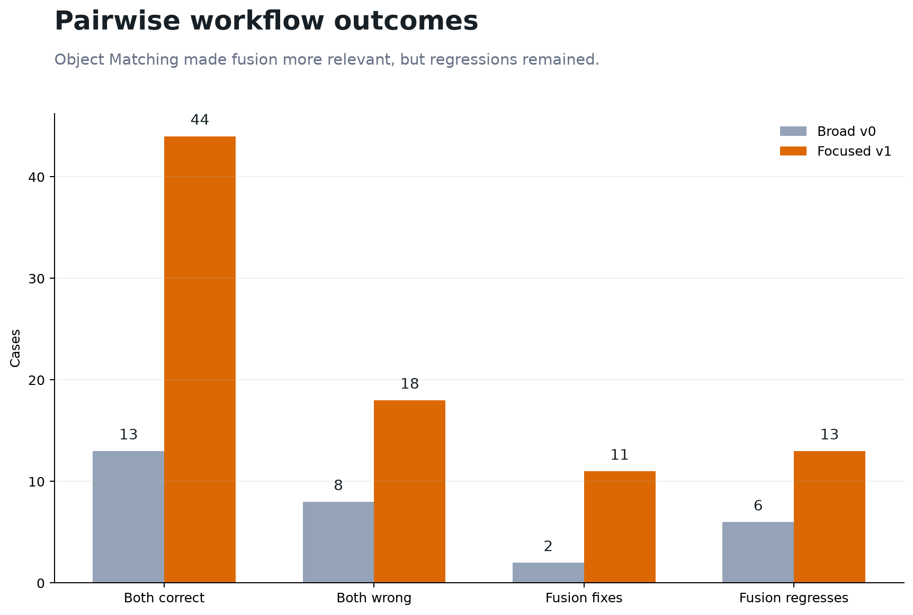
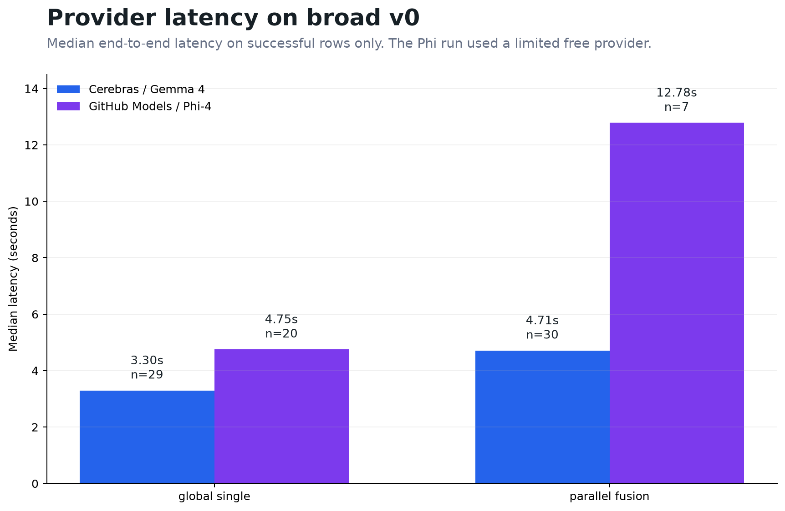

# Benchmark Results

This document summarizes the benchmark results for **Latency-Scaled Multi-UAV Perception**.

The project asked:

> Can faster multimodal inference make richer multi-UAV workflows useful before their answers become stale?

The answer from these runs is mixed.

Cerebras-speed inference made the richer workflow more practical to run. But adding more inference calls did not automatically improve results. The tested fusion workflow fixed some cases, regressed others, and added latency.

---


## Broad v0 result

The broad benchmark used a fixed 30-case AirCopBench slice.

The hypothesis was that `parallel_uav_fusion` might improve difficult multi-UAV answers enough to justify its extra latency.

That did not happen.

| Workflow | Successful rows | Accuracy | Median latency | Actionable @ 3000 ms | Actionable @ 4000 ms | Actionable @ 5000 ms |
|---|---:|---:|---:|---:|---:|---:|
| `global_single` | 29 | 65.5% | 3.30 s | 24.1% | 51.7% | 62.1% |
| `parallel_uav_fusion` | 30 | 53.3% | 4.71 s | 0.0% | 10.0% | 40.0% |



`global_single` (in blue) was faster, more accurate, and more actionable overall than `parallel_uav_fusion` (in orange).

---

## Pairwise outcomes

Fusion was not useless. It fixed some global failures.

On shared broad v0 cases:

| Pairwise outcome | Count |
|---|---:|
| Both correct | 13 |
| Both wrong | 8 |
| Global wrong, fusion correct | 2 |
| Global correct, fusion wrong | 6 |



The problem is that fusion created more regressions than fixes, while also adding latency.

---

## Focused Object Matching result

The initial broad run showed one promising signal: Object Matching.

```text
Object Matching in broad v0:
  global_single = 1 / 4 = 25%
  parallel_uav_fusion = 3 / 4 = 75%
```

That led to a focused 86-case Object Matching run.

| Workflow | Rows | Accuracy | Median latency |
|---|---:|---:|---:|
| `global_single` | 86 | 66.3% | 2.54 s |
| `parallel_uav_fusion` | 86 | 64.0% | 3.67 s |

Focused pairwise outcomes:

| Pairwise outcome | Count |
|---|---:|
| Both correct | 44 |
| Both wrong | 18 |
| Global wrong, fusion correct | 11 |
| Global correct, fusion wrong | 13 |

The focused run narrowed the gap, but did not reverse it. Fusion fixed more cases than before, but still regressed about as many and stayed slower.

---

## Provider latency

The provider comparison is a speed probe, not a clean architecture comparison as it is already expected for Cerebras inference times to excel. As well, the Phi run used a limited free GitHub Models provider and therefore had low usage for results.

On successful broad v0 rows:

| Workflow | Cerebras / Gemma 4 | GitHub Models / Phi-4 |
|---|---:|---:|
| `global_single` | 3.30 s, n=29 | 4.75 s, n=20 |
| `parallel_uav_fusion` | 4.71 s, n=30 | 12.78 s, n=7 |



Cerebras/Gemma4 (in blue) reduced latency compared to Phi4 (through Github Models), especially for the multi-call workflow. But speed alone did not make the parallel fusion better.

---

## Conclusion

The result is not:

> more agents are better.

The result is:

> Cerebras-speed inference expands the design space for applied multi-agent UAV workflows, but adding more inference calls does not guarantee better results.

The simple parallel-per-image workflow recovered some hard cases, especially in Object Matching, but it also introduced comparable regressions and added coordination latency.

This implies that future multi-agent UAV workflows should be more selective as for when to use more inference.

Especially in usecases where correct but late is stale. And where more compute is not automatically better.
